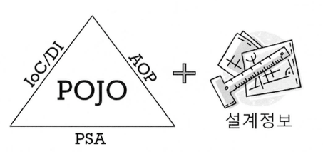

# 07. 스프링 삼각형과 설정 정보


## 스프링 삼각형 ?  

> ***스프링의 주요 기술인 IoC/DI, AOP와 PSA는 애플리케이션을 스프링의 핵심인 POJO(Plain Old Java Object)로 개발할 수 있게 해주는 가능 기술이라고 불린다.***



###### * POJO : 특정 기술에 종속되어 동작하는 것이 아닌 순수한 자바 객체를 말한다. [참고](https://siyoon210.tistory.com/120)

<br/>

## IoC/DI - 제어의 역전/의존관계 주입 

> ***스프링의 IoC(Inversion of Control / 제어의 역전)라고도 하는 DI(Dependency Indection / 의존관계 주입)***

###### * IoC : 프로그램의 **제어 흐름을 직접 제어하는 것이 아니라 외부에서 관리**하는 것을 의미

<br/>

###### 운전자 ➔ 자동차 ➔ 타이어

- 전체가 부분에 의존한다고 표현할 수 있다.
- 의존하는 객체(전체)와 의존되는 객체(부분) 사이에 `집합 관계(Aggregation)`와 `구성 관계(Composition)`로 구분할 수 있다.
   - 구성 관계 : 약한 포함 관계 ➔ 운전자가 사라지더라도 자동차는 다른 곳에 있다.
   - 집합 관계 : 강한 포함 관계 ➔ 자동차가 사라지면 타이어도 사라진다. 

<br/>

일반적으로 의존관계는 **new 키워드**를 통해 만들어진다.

```java
public interface Tire {
    private String getBrand();
}

public class KoreaTire implements Tire {
    public String getBrand() {
        return "코리아 타이어";
    }
}

public class AmericaTire implements Tire {
    public String getBrand() {
        return "미국 타이어";
    }
}
```

**1-1.** 운전자가 자동차를 ~~생산한다.~~ > 선택한다.

**1-2.** 자동차는 내부적으로 타이어를 ~~생산한다.~~ >  선택한다.

```java
public class Car {
    private Tire tire;
    
    public Car() {
        tire = new KoreaTire(); // 1-2.
        // tire = new AmericaTire();
    }
    
    public String getTireBrand() {
        return "장착된 타이어 : " + tire.getBrand();
    }
}

public class Driver {
    public static void main(String[] args) {
        Car car = new Car();	// 1-1.
        System.out.println(car.getTireBrand());
    }
}
```

위의 예제는 의존이 일어나고 있는 두 객체 사이에 직접 의존성을 해결하는 코드를 작성해보았다. 하지만 이러한 방식은 객체 간의 **강결합(Tightly Coupled)**으로 묶여지면서 <u>코드의 유연성을 떨어트리고</u> <u>코드의 중복 및 가독성을 떨어트리는</u> 원인이 된다. IoC/DI를 적용해보자!

<br/>

**2-1.** 운전자가 타이어를 선택한다.

**2-2.** 운전자가 자동차를 선택하면서 타이어를 장착한다.

```java
public class Car {
    private Tire tire;
      
    public Car(Tire tire) {
        this.tire = tire;
    }
    
    public String getTireBrand() {
        return "장착된 타이어 : " + tire.getBrand();
    }
}

public class Driver {
    public static void main(String[] args) {
        Tire tire = new KoreaTire(); // 2-1.
        // Tire tire = new AmericaTire();
        Car car = new Car(tire); // 2-2.
        System.out.println(car.getTireBrand());
    }
}
```

**의존관계를 주입**하면서 Car는 어떤 Tire가 들어오는지 알 필요가 없으며 Tire 인터페이스를 구현한 어떤 객체가 들어오는기만 정상적으로 작동하게 된다. 또한, 나중에 새로운 타이어 브랜드가 생겨도 Tire 인터페이스를 구현한다면 Car.java 코드를 변경할 필요 없이 확장시킬 수 있다. 의존성을 만드는 일은 더 이상 `Car` 이 직접 하는 것이 아니고 운전자에 의해 만들어지기 때문에 **제어권이 역전**되었다고 볼 수 있다.

<br/>

#### ***"강결합을 없애고 코드의 유연성을 확보한 방법 중 하나가 <u>IoC(제어의 역전)이고 DI(의존관계  주입)</u>인 것이다."*** 

- IoC(제어의 역전) : 프로그램의 **제어 흐름을 직접 제어하는 것이 아니라 외부에서 관리**하는 것을 의미

- **IoC(제어의 역전)/DI(의존성 주입)** 는 객체 간의 결합도를 줄이고 유연한 코드를 작성하게 하여 가독성 및 코드의 중복, 유지보수를 편하게 할 수 있게 한다.

<br/>

>  ***토비의 스프링에서는 다음의 세 가지 조건을 충족하는 작업을 의존관계 주입이라 말한다.***
>
>  - *클래스 모델이나 코드에는 런타임 시점의 의존관계가 드러나지 않는다. 그러기 위해서는 인터페이스만 의존하고 있어야 한다.*
>
>  - *런타임 시점의 의존관계는 컨테이너나 팩토리 같은 제 3의 존재가 결정한다.*
>
>  - *의존관계는 사용할 오브젝트에 대한 레퍼런스를 외부에서 제공(주입)해줌으로써 만들어진다.*
>
>    *- 이일민, 토비의 스프링 3.1, 에이콘(2012), p114*

<br/>

## 스프링을 통한 의존관계 주입

> ***스프링에서는 위와 같은 KoreaTire, AmericaTire 등을 <u>컨테이너(Container)</u>라는 곳에서 <u>Bean이라는 인스턴스 형태</u>로 관리한다. 스프링에서는 <u>XML이나 java config, annotation</u>을 통해서 컨테이너 설정 정보 및 Bean 객체 그리고 의존성 관계 정보를 입력할 수 있다. 여기서 Bean은 스프링 컨테이너 상에서 생성된 객체라고 보면 된다. 또한, 컨테이너는 스프링에서 IoC 원칙을 통한 객체와 그 의존성들을 관리하기 위해 만든 요소이다.*** 

###### * Bean : IoC 컨테이너에 의해 관리되는 객체 

<br/>

### 설정 파일(XML)을 통한 

###### XML 파일로 Bean을 직접 등록하는 것은 고전적인 방법이다.

```xml
<!-- application.xml -->
<?xml version="1.0" encoding="UTF-8"?>
<beans xmlns="http://www.springframework.org/schema/beans"
       xmlns:xsi="http://www.w3.org/2001/XMLSchema-instance"
       xsi:schemaLocation="http://www.springframework.org/schema/beans http://www.springframework.org/schema/beans/spring-beans.xsd">

    <!-- Bean을 등록하는 과정 -->
    <bean id="koreaTire" class="com.spring.KoreaTire"/>
    <bean id="americaTire" class="com.spring.AmericaTire"/>

    <!-- Bean을 의존관계 주입(DI)하는 과정 -->
    <bean id="car" class="com.spring.Car">
        <!-- 속성 주입 1 : 생성자를 통한 방법 -->
        <constructor-arg ref="koreaTire"/>
        <!-- 속성 주입 2 : Setter를 통한 방법 -->
        <!-- <property name="tire" ref="koreaTire"/> -->
    </bean>
</beans>
```

```java
public class Driver {
    public static void main(String[] args) {
        // ApplicationContext : 스프링 객체 조립도구
        ApplicationContext context = new ClassPathXmlApplicationContext("application.xml");
 
        // ioc 컨테이너에 담긴 객체를 사용할 때 bean의 id 값을 이용하여 사용
        Car car = context.getBean("car", Car.class); 
    }
}
```

만약, americaTire로 변경하고 싶다면 어떻게 하면 좋을까? 코드의 내용을 변경할 필요 없이 XML에서 ref 속성만 변경해주면 된다. 그런데 이렇게 다른 객체를 사용하려고 할 때 굳이 XML 안의 bean 태그까지 가서 코드를 직접 바꿔야 할까...?

<br/>

### @Autowired를 통한

```xml
<?xml version="1.0" encoding="UTF-8"?>
<beans ...>
  
    <!-- 스프링에게 @Autowired 찾아서 사용하라는 코드 -->
    <context:annotation-config />
  
    <bean id="koreaTire" class="com.spring.KoreaTire"/>
    <bean id="americaTire" class="com.spring.AmericaTire"/>
    <bean id="car" class="com.spring.Car"/>
</beans>
```

```java
public class Car {
  	@Autowired
    private Tire tire;
      
    public Car(Tire tire) {
        this.tire = tire;
    }
}
```

- **`@Autowired`** 은 bean의 **객체 타입**이 일치하는 객체를 자동으로 주입한다.
- **`@Autowired`** 는 Setter, 생성자 또는 필드에 선언해주면 된다. 
- **`@Autowired`** 의 속성 중 type과 id 가운데 매칭 우선순위는 **type** 이 높다.

###### * @Autowird는 자료형을 기준으로 객체를 찾아 주입을 시킨다. 자료형이 같은 객체가 두 개 이상이면 @Qualifier와 함께 사용한다.

<br/>

### @Resource를 통한

```java
public class Car {
    @Resource
    private Tire tire;
      
    public Car(Tire tire) {
        this.tire = tire;
    }
}
```

- **`@Resource`** 은 bean의 **id 속성**이 일치하는 객체를 자동으로 주입한다.
- **`@Resource`** 은 생성자를 제외한 Setter, 필드에 선언해주면 된다.
- **`@Resource`** 의 속성 중 type과 id 가운데 매칭 우선순위는 **id** 가 높다. 0

<br/>

---

---

#### 스프링 의존관계 주입하는 다양한 방법 [참고](https://mangkyu.tistory.com/125?category=761302)

1. 생성자 주입
2. Setter 주입
3. 필드 주입


#### 스프링 빈을 등록하는 다양항 방법 [참고1](https://velog.io/@probsno/%EC%8A%A4%ED%94%84%EB%A7%81-%EB%B9%88%EC%9D%84-%EB%93%B1%EB%A1%9D%ED%95%98%EB%8A%94-%EB%8B%A4%EC%96%91%ED%95%9C-%EB%B0%A9%EB%B2%95%EB%93%A4), [참고2](https://wordbe.tistory.com/entry/Spring-IoC-%EB%B9%88-%EB%93%B1%EB%A1%9D-%EB%B0%A9%EB%B2%95-5%EA%B0%80%EC%A7%80)

1. XML 설정 파일
2. XML + ComponentScan
3. Java Config
4. Java Config + ComponentScan
5. Spring Boo